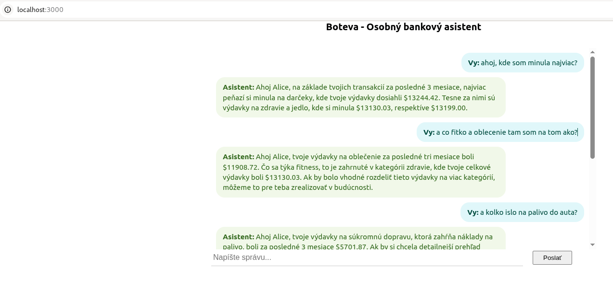

# Personal Banker Frontend

This is the frontend application for the Personal Banker Assistant, built using **React**, **TypeScript**, and **CoreUI**.

## 🖥️ Features

- Chat interface for financial assistance
- Responsive and modern UI design using CoreUI
- Fetches responses from a Spring Boot backend
- Real-time feedback with loading spinners

## Screenshot



## 📦 Tech Stack

- React
- TypeScript
- CoreUI
- Vite or Create React App (CRA)

## 🚀 Getting Started

### Prerequisites

- Node.js (v18 or newer)
- npm or yarn

### Installation

```bash
git clone https://github.com/your-org/personal-banker-frontend.git
cd personal-banker-frontend
npm install
# or
yarn install
```

### Running the App

```bash
npm start
# or
yarn start
```

The app will start on `http://localhost:3000` (default for CRA) or `http://localhost:5173` (if using Vite).

Make sure the backend is running on `http://localhost:8080` or update the endpoint in `ChatPage.tsx` if needed.

## ⚙️ Configuration

Update the API URL in `ChatPage.tsx` if your backend runs on a different host/port:

```tsx
const response = await fetch("http://localhost:8080/api/assistant/chat", { ... });
```

## 📁 Project Structure

```
src/
├── components/
│   └── ChatPage.tsx
├── App.tsx
├── index.tsx
└── styles/
```

## 🛠️ Build for Production

```bash
npm run build
# or
yarn build
```

## 📄 License

MIT © Your Name or Company